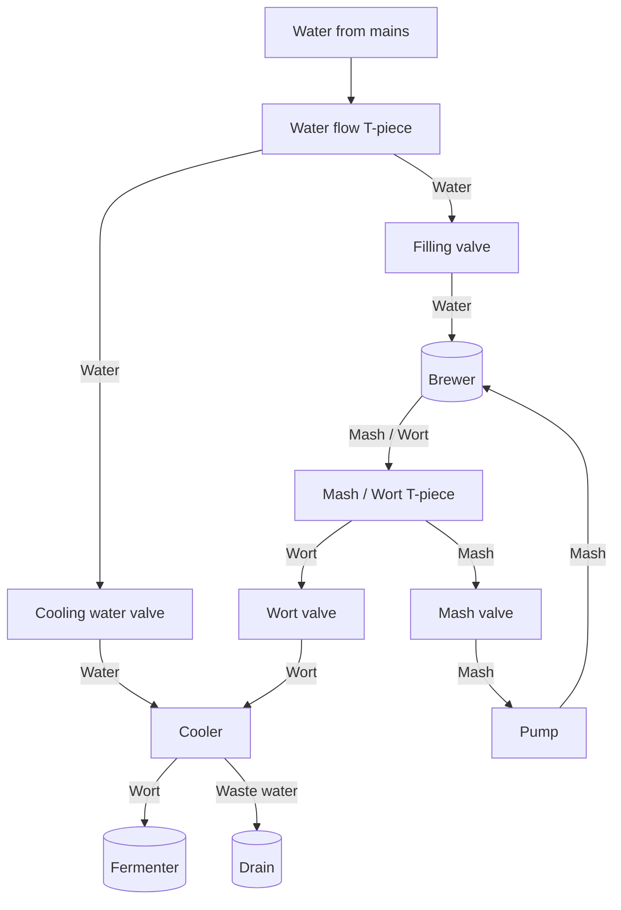

# brew_notes

General notes on my brewing history / experiments

In the [brews](brews) dir I will keep the different brews I have tried

In the [history](history) I will keep a record of all the brews

## Brewing setup:

 - Brewer: Brewster NG
 - Pump: Brewolution TL-B08H-12-0703-W
 - Cooler: Plate chiller - Maltbazaren 12 plates


## Brewchart


## Brewing process notes:
  - Unroll the mains lead
  - Fill up tank with mash inlay and 16 litres of water - 12 cm from the top
  - Heat to [Mashing temp]
  - Prepare 115 g boiling water for rehydrating of yeast
  - Add brew bag and add Barley and keep on [Mashing temp] for [Mashing period] / stir well 
  - Remove brew bag and adjust to boiling temp for [Boiling period]
  - Prepare hops packages for taste / aroma hopping and add them at appropriate times
  - When rehydrating water is at 35 C, pour in the yeast and stir it gently after 15 mins
  - Prepare fermenting tanks and thrumometer
  - With 15 mins left of boiling, run first 1 DL Wort through the cooler, which is thrown out.
  - Then run 3-4l through the cooler which is reintroduced to the boiling wort
  - Attach thrumometer and cooling hoses
  - Start water flow for the cooler and run wort through the cooler, adjust water according to the temperature, aim for 24-26 C
  - Take an OG measurement
  - Add yeast
  - Add Acid SAN water to the fermenter-top

## Bottling process notes:
  - Clean a new fermenter / fermenting bucket, preferrebly with a valve
  - Move the fermented beer into the new fermenting bucket, pour gently to avoid the sediment in the bottom
  - Prepare 6g sugar pr liter of beer (60g), in 2 DL water
  - Prepare the bottles
    - Wash in normal cleaning solvent first
    - Then make a solution of Acid San and soak for 60 seconds and place upside down in rack
  - Do an FG measurement
  - Add the sugar in the new fermenter and stir
  - Fill bottle with 1 cm air gap
  - Cap bottles


## General notes:
```
Under the mash inlay: 6l of water
14.5 litres = 14 cm from the top of the inlay
16 litres = 12 cm from the top

Normal 10 litre brew:

Mashing - 16 litres
```

| Litres | CM from top |
| --- | --- |
| 25 | 2 |
| 19 | 10 |
| 16 | 12 |
| 15 | 13,5 |
| 14 | 15 |
| 13 | 16 |
| 12 | 17 |
| 11 | 18 |
| 10 | 19 |

