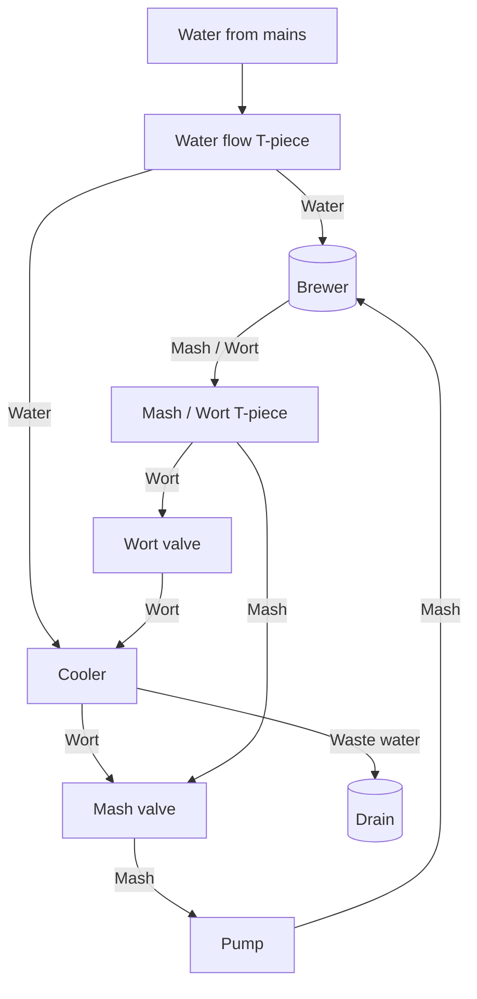

# brew_notes

General notes on my brewing history / experiments

In the [brews](brews) dir I will keep the different brews I have tried

In the [history](history) I will keep a record of all the brews

## Brewing setup:

 - Brewer: Brewster NG
 - Pump: Brewolution TL-B08H-12-0703-W
 - Cooler: Plate chiller - Maltbazaren 12 plates

## Brewchart

## Brewing process notes:
Fill up 4-5 litres of water from water mains
Bring to boiling
Run through Mash water circuit
Run through Cooler circuit and into the sink

## General notes

Under the mash inlay: 6l of water
14.5 litres = 14 cm from the top of the inlay
16.5 litres = 11.5 cm from the top

Normal 10 litre brew:

Mashing - 16.5 litres
Boiling ~ 16 litres
