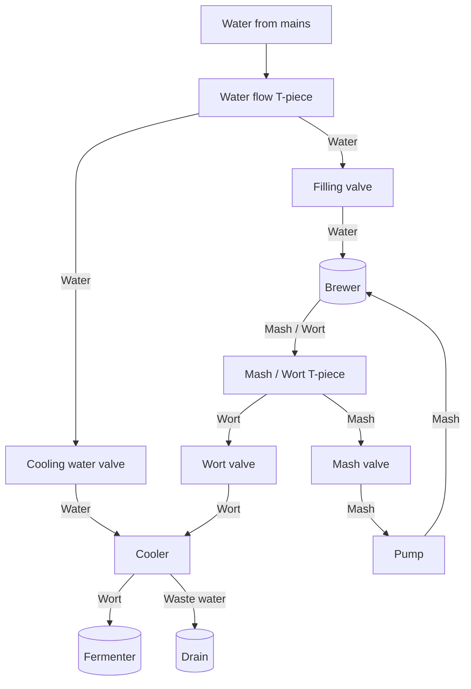

# brew_notes

General notes on my brewing history / experiments

In the [brews](brews) dir I will keep the different brews I have tried

In the [history](history) I will keep a record of all the brews

## Brewing setup:

 - Brewer: Brewster NG
 - Pump: Brewolution TL-B08H-12-0703-W
 - Cooler: Plate chiller - Maltbazaren 12 plates


## Brewchart


## Brewing process notes:
  - Unroll the mains lead
  - Fill up tank with mash inlay and 16.5 litres of water
  - Heat to [Mashing temp]
  - Add Barley and keep on [Mashing temp] for [Mashing period] / stir well 
  - Add Mash recirculation ring and start pump
  - Heat up water for mashout (78 C)
  - After [Mashing period] lift the mash inlay and start mashout
  - Adjust to [Mashout temp] for [Mashout period]
  - Mashout until 16l of mash is left in the brewer and [Mashout period] is up
  - Remove mash inlay and adjust to boiling temp for [Boiling period]
  - Prepare hops packages for taste / aroma hopping and add them at appropriate times
  - Prepare fermenting tanks and thrumometer
  - With 15 mins left of boiling, run first 1 DL Wort through the cooler, which is thrown out.
  - Then run 3-4l through the cooler which is reintroduced to the boiling wort
  - When boiling is complete do an OG measurement
  - Attach thrumometer and cooling hoses
  - Start water flow for the cooler and run wort through the cooler, adjust speed according to the temperature
  - Take a last measurement of the temperature
  - Add yeast
  - Scold the lid and the fermenter-top and put the lid on the fermenter
  - Add boiled water to the fermenter-top


## General notes
```
Under the mash inlay: 6l of water
14.5 litres = 14 cm from the top of the inlay
16.5 litres = 11.5 cm from the top

Normal 10 litre brew:

Mashing - 16.5 litres
Boiling ~ 16 litres
Goal - 11 litres ~ 18 cm from top
```
